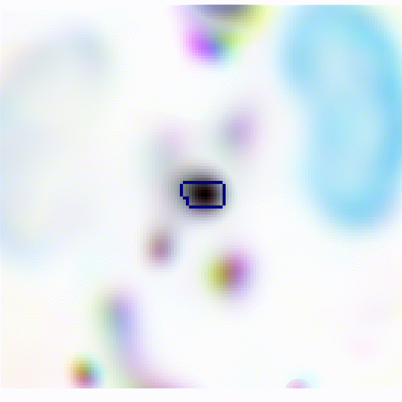

This is a set of scripts perform sequential contour-guided rigid registration for serial DICOM images with an RT structure set contoured on the first image time point. The workflow was developed for the purposes of assessing radionuclide dosimetry on post-treatment quantitative SPECT/CT images; essentially converted to PET format (file-per-slice, units Bq/ml).

Check python scripts to confirm paths of elastix/transformix (image registration), plastimatch (image resampling and RT structure-to-labelmap conversion), and ffmpeg (animaged RGB MIPs to confirm aligment of each structure).

Rather than saving the output from each co-registered structure which is quite memory-intensive, the workflow outputs a three-colour MIP which can quickly illustrate the alignment of the focused PET region in 3D and saves the measured PET intensity values for each image set in CSV format.

The operation takes a folder of dicom files. Each series should be in its own nested sub-directory to run as-is. It will sort the dicom studies by date and modality and should save them in the appropriate intermediate images CT1.nrrd-CT3.nrrd and PT1.nrrd-PT3.nrrd.

Images are resampled to 1.5mm cubic voxels by default (this may be modified in the main script) which assists with dilating the labels uniformly along each axis and should not adversely affect quantitative measurements from the functional images.

The range of the dilation in resampled voxel units may also be designated. For PET-guided registration it has been beneficial to perform in two stages which may be input as a list in the function:
multi_res_cropped(fixed_im,moving_im,label_path,[pet_dilation1,pet_dilation2],initial_params,fine_params,out_dir)

CT and PET-guided registration benefit from independently-designated dilation ranges. This may be worthwhile to modify for selected applications.

The processing routine was developed for pharmacokinetics assessment of a cohort of patients receiving radionuclide therapy. Each patient was contoured with a standardised set of organ contours and variety of tumour contours (denoted by a first character 'x'). This presents an automated means to perform focused rigid registration for each individual contour with greater overall accuracy than whole-body deformable algorithms routinely achieve. Following alignment, the program measures mean activity concentration and, by generating 3d animations, allows operators to quickly verify the accuracy of each region's alignment across all three timepoints for inclusion in analysis.

